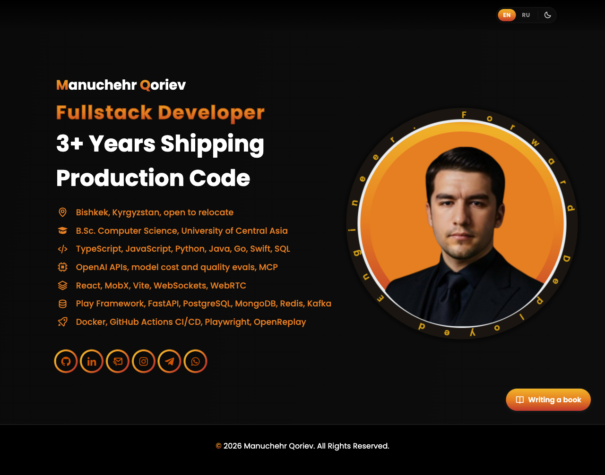

# Manuchehr Qoriev, Portfolio



React portfolio (Vite). One page: hero with contacts, a header control track with the English/Russian switcher and dark/light theme, and a floating link to the book repo.

## Run locally

**All in one** (copy-paste):

```bash
git clone git@github.com:manuchehrqoriev798/Qoriev-Manuchehr-Personal-Website.git
cd Qoriev-Manuchehr-Personal-Website
npm install
npm run dev
```

**Or step by step:**

Clone:

```bash
git clone git@github.com:manuchehrqoriev798/Qoriev-Manuchehr-Personal-Website.git
```

Enter project and install:

```bash
cd Qoriev-Manuchehr-Personal-Website
npm install
```

Start dev server:

```bash
npm run dev
```

Open http://localhost:5173

## Book link

A fixed pill in the bottom-right corner, linking to
[my-story](https://github.com/manuchehrqoriev798/my-story). It replaced the Voiceflow
chatbot that used to sit there. Label and URL live in `BOOK_LINK` in
[src/constants/siteContent.js](src/constants/siteContent.js).

## Stack

- React 19, Vite 7
- CSS Modules, BoxIcons

## Structure

| Path | Contents |
|------|----------|
| `src/components/` | Header, Hero, Footer, SocialLinks, ThemeToggle, LanguageToggle, BookLink |
| `src/contexts/` | ThemeProvider and LanguageProvider, with their hooks |
| `src/constants/siteContent.js` | Copy and links, incl. `BOOK_LINK` |
| `src/index.css` | Global styles and theme variables |

## UI components

For ready-made components and patterns: [21st.dev](https://21st.dev/home): infrastructure and UI building blocks.
